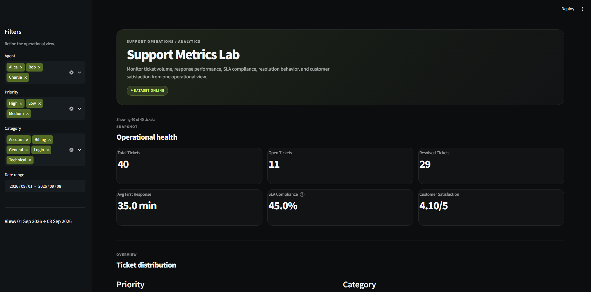
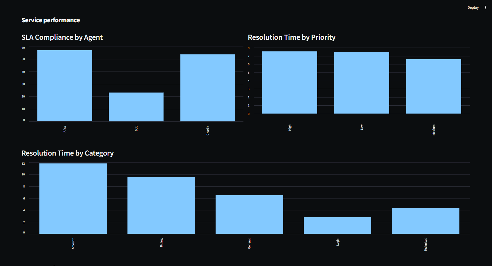
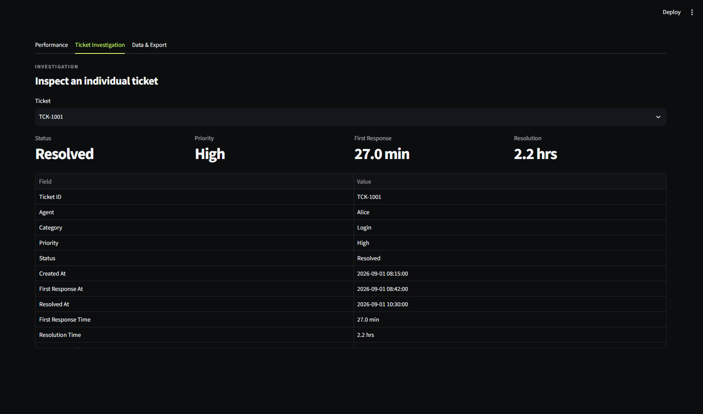

# Support Metrics Lab

Support Metrics Lab is a support operations analytics dashboard built with Python, Pandas, and Streamlit.

The application ingests support ticket data from CSV, validates and normalizes the data, calculates operational metrics, and provides an interactive dashboard for investigating support performance.

## Features

* Import support tickets from CSV
* Validate and normalize ticket data
* Analyze first-response times
* Analyze resolution times
* Track SLA compliance
* Visualize ticket volume trends
* Analyze agent performance
* Break down tickets by priority and category
* Filter results by date, agent, priority, and category
* Investigate individual tickets
* Export filtered ticket data to CSV
* Automated metric tests with pytest

## Technologies

* Python
* Pandas
* Streamlit
* pytest
* CSV

## Project Structure

```text
SupportMetricsLab/
├── data/
│   └── tickets.csv
├── src/
│   ├── __init__.py
│   ├── data_loader.py
│   └── metrics.py
├── tests/
│   ├── __init__.py
│   └── test_metrics.py
├── app.py
├── requirements.txt
└── README.md
```

## Getting Started

### Requirements

* Python 3.14 or compatible Python version
* pip

### Installation

Clone the repository:

```bash
git clone https://github.com/sedki1223/support-metrics-lab.git
cd support-metrics-lab
```

Install the dependencies:

```bash
pip install -r requirements.txt
```

## Run the Dashboard

Start the Streamlit application:

```bash
streamlit run app.py
```

Streamlit will provide a local URL that you can open in your browser.

## Testing

Run the automated tests with:

```bash
python -m pytest
```

The test suite validates the support-metric calculations used by the application.

## Data

The project includes a sample support-ticket dataset in:

```text
data/tickets.csv
```

The dashboard uses this data to demonstrate support-performance analysis and filtering.

## Purpose

This project was built as a practical analytics and support-operations project focused on:

* Data processing with Pandas
* Operational KPI analysis
* SLA monitoring
* Interactive dashboard development
* Data validation
* Automated testing
* Exporting filtered operational data

## Screenshots

### Dashboard


### Performance


### Ticket Investigation


## Project Status

Completed and functional.

## Author

Sedki Dabboubi
